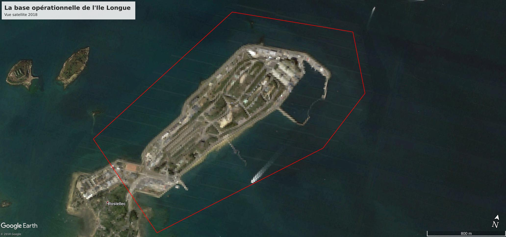
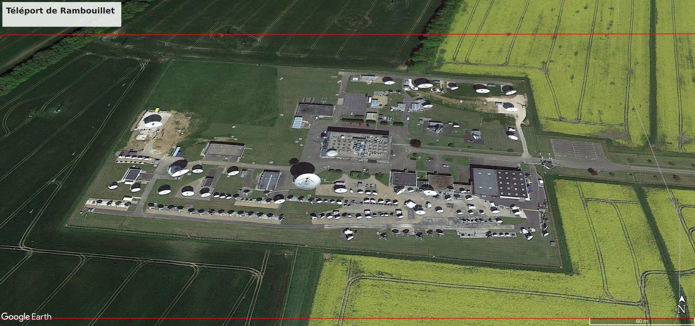

## Les ZIPVA

Les **ZIPVA** (Zones interdites à la prise de vue aérienne) sont des zones délimitées par voie d'arrêté qui couvrent des installations sensibles de l'Etat.

Ces zones sont interdites à la prise de vue aérienne "par appareil photographique, cinématographique ou tout autre capteur". La première version date du 27 janvier 2017, dans laquelle figurait 157 sites, porté à 247 le 27 octobre 2017, 289 le 12 octobre 2018, et 291 à la rédaction de cet article, dans l'arrêté du 03 mars 2019.

D'après [un article de L'Essor de la Gendarmerie nationale](https://lessor.org/a-la-une/floutage-sites-sensibles/), ce fichier a été créé pour répondre à la généralisation des drones de loisir. C'est un groupe de travail du Secrétariat général de la défense et de la sécurité nationale (SGDSN) qui travaillerait sur ces questions, en partenariat avec les ministères concernés et des acteurs privés, dont Google et la fédération professionnelle du drone civil.

Plusieurs ministère sont à l'origine de l'inscription des ces zones dans ce fichier. Les zones peuvent être consultées dans le Journal Officiel ([Arrêté du 1er mars 2019 fixant la liste des zones interdites à la prise de vue aérienne par appareil photographique, cinématographique ou tout autre capteur](https://www.legifrance.gouv.fr/affichTexte.do?cidTexte=JORFTEXT000038191339&categorieLien=id)) et visualisées sur [Geoportail](https://www.geoportail.gouv.fr/donnees/zones-interdites-a-la-prise-de-vue-aerienne) (données caduques de l'arrêté du 12 octobre 2018).

La dernière actualisation du fichier date du 03 mars 2019. A la demande du ministère de l'intérieur, elle ajoute deux zones à l'arrêté du 12 octobre 2018: le Fort de Brégançon et La Lanterne. Ces deux zones sont des résidences d'état où le Président de la République peut être amené à séjourner.

C'est tout le paradoxe de ce fichier, qui à vouloir protéger des sites sensibles, expose aux yeux de tous leur localisation, à défaut de leur nom ou de leur usage.
Quelques techniques d'[OSINT](https://fr.wikipedia.org/wiki/Renseignement_d%27origine_source_ouverte) nous permettent d'en retrouver la dénomination, avec une fiabilité assez bonne, en dépit du caractère secret de certain de ces sites.

Le curieux qui ira chercher à survoler ces sites sur Google Maps observera qu'ils y sont masqués.
Cette censure prend le plus souvent la forme de floutage sur Street view, ou de pixelisation sur vue Satellite. Parfois, la qualité de la vue satellite est tout simplement très dégradée.

Néanmoins la fonctionalité "Timelaps" de Google Earth qui permet de remonter dans les archives, dévoile la plupart de ces zones aux yeux de tous. La plupart des images de cet article sont issues de ces archives.
Exemple avec l'Île Longue dans le Finistère, qui sert de base sous-marine aux sous-marins nucléaires lanceurs d'engins (SNLE) :

Plus étonnant, pour certains lieux comme le siège de la DGSI à Levalloit, la vue satellite y est lourdement pixelisée, mais il existe une modelisation 3D des bâtiments particulièrement détaillée :

Les données publiées en [Open Data](https://www.data.gouv.fr/fr/datasets/zones-interdites-a-la-prise-de-vue-aerienne-1/) comportent des métadonnées : le numéro de zone (Area), la commune, le site, le département, le ministère, la zone aéro, et la date d'effet.
Chaque zone est délimitée par un polygone, dont les coordonnées sont celles publiées dans le journal officiel.

Nous pouvons déjà dresser une première étude des ministères à l'origine des demandes d'inscription au fichier.

| Ministère                                                   | Nombre de ZIPVA |
|-------------------------------------------------------------|:----------------|
| Ministère de la Justice                                     | 89              |
| Ministère de l'Intérieur                                    | 9               |
| Ministère des Armées                                        | 165             |
| Ministère de la Transition écologique et solidaire          | 26              |
| Ministère de l'Enseignement supérieur et de la Recherche    | 1               |
| Ministère Armée + Enseignement supérieur et de la Recherche | 1               |
| **Total**                                                   | **291**         |

*Ministère d'origine des ZIPVA du 03 mars 2019*

Intéressons nous maintenant aux bâtiments couverts par ces zones.

### Ministère de la Justice

La totalité des bâtiments couverts par le Ministère de la Justice concerne des établissements pénitentiaires.

Ici la prison de la Santé, modélisée en 3D mais tout de même floutée.
Le floutage des prisons sur Google Map a fait  débat dans les médias suite à l'évasion de Redoine Faïd en juillet 2018 (voir cet [article du Figaro](http://www.lefigaro.fr/actualite-france/2018/10/09/01016-20181009ARTFIG00229-passe-d-arme-entre-belloubet-et-google-sur-le-floutage-des-prisons.php)).

### Ministère de la Transition écologique et solidaire

Le ministère de la transition écologie et solidaire couvre l'ensemble des centrales nucléaires francaises, ainsi que divers sites liés à l'industrie nucléaire :

 - [L'usine de retraitement de la Hague](https://fr.wikipedia.org/wiki/Usine_de_retraitement_de_la_Hague)
 - Un ancien site en démentellement, le [Site nucléaire de Creys-Malville](https://fr.wikipedia.org/wiki/Site_nucl%C3%A9aire_de_Creys-Malville).
 - L'institut de recherche [Laue-Langevin](https://fr.wikipedia.org/wiki/Institut_Laue-Langevin) sur le Pole Technlogique de Grenoble.
 - L'usine [Orano Malvési](https://fr.wikipedia.org/wiki/Usine_Orano_Malvési), spécialisée dans la chimie de l'uranium.
 - Le [centre de recherche CEA Saclay](https://fr.wikipedia.org/wiki/Centre_CEA_de_Saclay) dans l'Essonne, les autres CEA étant inscrits par le ministère des Armées.
 - L'usine d'enrichissement d'uranium [Georges-Besse II](https://fr.wikipedia.org/wiki/Usine_Georges-Besse_II), dans la Drôme.

### Ministère de l'Enseignement supérieur et de la Recherche

Le ministère de l'enseignement supérieur et de la recherche protège le Centre Spatial Guyanais à Kourou (conjointement avec le Ministère des Armées qui y possède des antennes de la DGSE).
Plus étonnement, on trouve le [Téléport de Rambouillet](https://fr.wikipedia.org/wiki/T%C3%A9l%C3%A9port_de_Rambouillet).
Cette station terrestre de télécommunications héberge les antennes qui communiquent avec les satellites d'[Eutelsat](https://fr.wikipedia.org/wiki/Eutelsat) (satellites radio/TV/Internet).

### Ministère de l'Intérieur

Le Ministère, outre les sites du Fort de Brégançon et La Lanterne rajoutés en 2019 et déjà mentionnés, protège 7 autres sites :

 - La [Direction Générale de la Gendarmerie Nationale](https://fr.wikipedia.org/wiki/Direction_g%C3%A9n%C3%A9rale_de_la_Gendarmerie_nationale) à Issy-les-Moulineaux
 - Le siège de la [Direction générale de la Sécurité intérieure (DGSI)](https://fr.wikipedia.org/wiki/Direction_g%C3%A9n%C3%A9rale_de_la_S%C3%A9curit%C3%A9_int%C3%A9rieure) et de la [Sous-direction anti-terroriste (SDAT)](https://fr.wikipedia.org/wiki/Sous-direction_anti-terroriste) à Levallois-Perret
 - Le [Pôle judiciaire de la Gendarmerie nationale (PJGN)](https://fr.wikipedia.org/wiki/P%C3%B4le_judiciaire_de_la_Gendarmerie_nationale) à Pontoise
 - Le [Groupement blindé de Gendarmerie mobile (GBGM)](https://fr.wikipedia.org/wiki/Groupement_blind%C3%A9_de_gendarmerie_mobile) sur le plateau de Satory (Versaille)
 - La caserne Pasquier de Satory (Versaille), garnison du GIGN

*La caserne Pasquier en premier plan avec le  Groupement blindé de Gendarmerie mobile en second plan*

 - La [Direction Générale de la Sécurité Civile et de la Gestion des Crises](https://fr.wikipedia.org/wiki/S%C3%A9curit%C3%A9_civile_en_France#%C3%89chelon_national_:_la_direction_g%C3%A9n%C3%A9rale_de_la_s%C3%A9curit%C3%A9_civile_et_de_la_gestion_des_crises) à Asnière
 - Le centre d'écoute des télécommunications de la DCRI (ex DGSI) à Boullay-les-Troux (Essonne).

### Ministère des Armées

Le Ministère des Armée est sans surprise celui qui floute le plus de sites dans le ZIPVA (165 sites, soit 57%). 
Outre les bases aériennes, casernes, et centres de ravitaillement, on y trouve une grande variétée de sites.

Des installations militaires liées à la dissuasion nucléaire :

 - La [base opérationnelle de l’Ile Longue](https://fr.wikipedia.org/wiki/%C3%8Ele_Longue_(Finist%C3%A8re))
 - L'[Usine du Bouchet](https://fr.wikipedia.org/wiki/Usine_du_Bouchet)
 - Le [CEA de Bruyères-le-Châtel](https://fr.wikipedia.org/wiki/CEA_de_Bruy%C3%A8res-le-Ch%C3%A2tel)
 - Le [centre spécial de montage de Valduc (CEA)](https://fr.wikipedia.org/wiki/Valduc)
 - Le site du [Laser Mégajoule](https://fr.wikipedia.org/wiki/Laser_M%C3%A9gajoule)
 - Le [CEA Centre de Cadarache](https://fr.wikipedia.org/wiki/Centre_de_Cadarache)
 - [DGA Essais de missiles](https://fr.wikipedia.org/wiki/DGA_Essais_de_missiles)
 - Le [Site nucléaire de Marcoule](https://fr.wikipedia.org/wiki/Site_nucl%C3%A9aire_de_Marcoule)
 - [Sodern](https://fr.wikipedia.org/wiki/Sodern), partenaire privé qui développe et produit les sources neutroniques pour la force de dissuasion nucléaire française
 
 Les antennes de la Force océanique stratégique qui communiquent avec les sous-marins nucléaires (SNA / SNLE) avec entre autres:

  - Le [Centre de transmissions de la Marine nationale de Rosnay](https://fr.wikipedia.org/wiki/Centre_de_transmissions_de_la_Marine_nationale_de_Rosnay)
  - Le [Centre de transmissions marine (CTM) de Sainte-Assise](https://fr.wikipedia.org/wiki/%C3%89metteur_de_Sainte-Assise)
  - Le [Centre de transmission de Kerlouan](https://fr.wikipedia.org/wiki/Centre_de_transmission_de_Kerlouan)
  - Centre de Transmissions de La Regine
  - Le Centre de transmissions (CTM) de la Marine nationale - La Lauzette Villepinte

Les sites de la DGSE :

 - Le Fort de Noisy
 - La Caserne des Tourelles

Les composantes de son Service Action :

 - Le Réduit de Quélern - Centre parachutiste d'entraînement aux opérations maritimes (CPEOM)
 - Terrain Militaire de St Laurent de la Salanque (CPIS)
 - Le centre d'entraînement spécialisé de Cercottes (CPES)

Et ses centres d'écoutes, réels ou supposés (voir [Frenchelon](https://fr.wikipedia.org/wiki/Frenchelon)) :

 - Station radiogoniométrique d'Ablis
 - Centre de réception radioélectrique Feucherolles
 - Centre de réception radioélectrique Alluets le Roi
 - Station du Centre Spatial Guyanais / Kourou
 - CRE (centre radio-électrique) et CTM (Centre de Télémesure Militaire) de Mayotte
 - Base aéronautique navale de Tontouta / DIRISI DGSE
 - Station radiogoniométrique de Bonifacio
 - Centre radioélectrique de Domme 
 - Centre radioélectrique de Saint-Christol d'Albion

*Au milieu de Kourou, une zone avec 3 grandes antennes apparentes, censurée par le Ministère des Armées*

### Et ailleurs ?

Il semblerait que cette pixelisation à outrance soit une obsession plutôt Française.
Il existe évidemment d'autres pays qui cherchent à masquer des lieux sensibles, voir aussi cette [liste très incomplète](https://en.wikipedia.org/wiki/List_of_satellite_map_images_with_missing_or_unclear_data) sur Wikipedia.
Néanmoins, la censure des autres pays occidentaux n'est pas aussi systématique et utilise des techniques plus subtiles que la pixelisation.

*Différence flagrante de résolution à la frontière USA-Mexique*

*L'imagerie recouvrant la base navale des SNLE britanniques est beaucoup plus opaque*

*Au contraire, cette autre base navale militaire britannique est richement détaillée en 3D*

*La Base navale de Gadjievo qui abrite les SNLE russes n'est pas particulèrement masquée, ni les bases américaines de Kitsap et de Kings Bay*

*La Chine a fait le choix de recouvrir d'un carré gris géant le village de Guwacun au Tibet.*

Lire aussi [Why large swathes of countries are censored on Google Maps](https://www.abc.net.au/news/2019-02-21/google-satellite-image-of-the-village-of-guwacun,-tibet/10830106).

## Bref

Comme le montre cet article, l'efficacité de ce fichier ZIPVA reste à démontrer.
Non content de dévoiler "officiellement" la localisation des sites sensibles, il reste impuissant, 2 ans après sa création, à cacher ces zones aux yeux curieux sur les plateformes d'imagerie en ligne.
